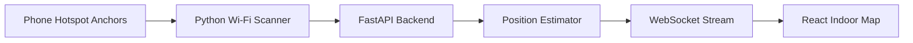

# RmFindr

**Spatial Intelligence and Indoor Tracking via Wi-Fi Fingerprinting.**


> **GPS stops at the front door. In Hong Kong, that's where the economy begins.**

RmFindr is an indoor spatial-intelligence layer for dense, vertical buildings. It turns the Wi-Fi signals already in the air into anonymous, real-time data on how assets and equipment move through a space — no cameras, no beacons, no new hardware, and no personal data. We track objects, not people.

Every business optimises around movement data. Outdoors, that data is everywhere. But in Hong Kong's stacked malls, interchange stations, warehouses, and cargo terminals, the way goods and equipment actually flow through a building is effectively invisible — GPS dies at the door and floor-level tracking is impossible. RmFindr makes that invisible movement measurable.

**Map a space once. Read the Wi-Fi signal pattern. Turn it into location intelligence.**

## The Problem

In dense cities like Hong Kong, the economy runs vertically — and the building floor is a data blind spot.

Outdoors, every vehicle and shipment can be tracked, mapped, and optimised. The moment goods, equipment, or operations move indoors, that visibility disappears. GPS is unreliable inside large buildings: they are dense, vertical, and full of signal-blocking walls, escalators, corridors, underground spaces, and overlapping floors.

Existing indoor positioning solutions often require dedicated hardware such as Bluetooth beacons, UWB tags, or expensive venue infrastructure — a cost that is hard to justify across millions of square feet of malls, warehouses, and terminals.

RmFindr explores a simpler question:

**What if buildings could be mapped using the Wi-Fi signals already around us?**

## Why Hong Kong

Hong Kong is the hardest indoor-location market in the world — and therefore the most valuable one to solve.

**Life happens inside stacked structures.** Harbour City, Times Square, IFC, Langham Place, and ELEMENTS are multi-level mega-malls, often bridged directly into each other and into the MTR. GPS is useless inside them, and even working out *which floor* something is on is a hard problem. The operational and movement data that every retailer, landlord, and logistics operator optimises around simply cannot be collected with today's tools.

**A logistics hub that can't see its own floors.** Hong Kong moves enormous volumes of goods through warehouses and the HKIA cargo terminals. Indoor asset tracking — where is the cage, the pallet, the forklift — is a direct operational cost, and it lives entirely indoors where GPS cannot reach.

**A concentrated, sophisticated set of buyers.** The people who own these spaces are few and well-resourced: Link REIT (the largest, owning the everyday malls and markets), Sun Hung Kai Properties, Swire (Pacific Place, Cityplaza), Wharf (Harbour City, Times Square), Henderson, and Hongkong Land (Central). A focused B2B sales motion can reach the whole market through a handful of relationships.

## Our Solution

Traditional Wi-Fi triangulation tries to calculate distance from signal strength. Indoors, that breaks down quickly. Signals bounce off walls, glass, doors, people, and metal surfaces. This is called multipath fading, and it makes pure geometric positioning unreliable.

RmFindr takes a different approach: **data over geometry.**

Instead of treating indoor signal distortion as noise, we use it as a fingerprint. Every location in a room has a slightly different combination of Wi-Fi signal strengths. By mapping those fingerprints once, we can later compare live readings against the map and estimate where the device is.

This is not GPS. It is indoor positioning through learned signal patterns.

## Core Demo

For the 24-hour prototype:

- Three phones act as fixed Wi-Fi anchors using personal hotspots.
- The anchors are placed around the room at known positions.
- A laptop acts as the moving scanner.
- The laptop reads RSSI signal strengths from the hotspot anchors.
- A FastAPI backend estimates the laptop's position.
- A React dashboard displays the result on a 2D indoor map.

The demo shows the full positioning loop:

1. Calibrate the room.
2. Scan live Wi-Fi signals.
3. Estimate the current position.
4. Visualize movement on the map.

## How It Works

### Calibration Mode

Before live tracking, RmFindr builds a fingerprint map.

The user clicks known points on the floor plan. At each point, the system saves the current Wi-Fi signal pattern from the three anchors.

Each calibration point connects a physical location with a signal fingerprint:

```json
{
  "x": 42,
  "y": 68,
  "signals": {
    "anchor_a": -51,
    "anchor_b": -67,
    "anchor_c": -74
  }
}
```

### Live Tracking Mode

During live tracking, the laptop continuously scans Wi-Fi signal strengths.

The backend compares the live signal pattern against the saved calibration fingerprints using a nearest-neighbor style estimator. The dashboard updates the estimated position as a moving dot on the indoor map.

## Dashboard

The React dashboard makes the positioning process visible at a glance:

- Fixed Wi-Fi anchor locations
- Saved calibration points
- Live RSSI readings
- Estimated current position
- Recent movement trail
- Confidence/status indicator

Judges can see the inputs, the learned fingerprint map, and the estimated position update in real time.

## System Architecture



1. **The Anchors:** Three phone hotspots provide stable Wi-Fi reference signals.
2. **The Scout:** A Python scanner reads nearby Wi-Fi RSSI values from the laptop.
3. **The Brain:** A FastAPI backend stores calibration fingerprints and estimates position.
4. **The Pulse:** WebSocket updates stream live position data to the dashboard.
5. **The Map:** A React interface renders anchors, fingerprints, live readings, movement trail, and position.

## Vision

RmFindr is a prototype for indoor visibility in dense, high-friction environments:

- Track cages, pallets, and forklifts across a warehouse floor.
- Locate handling units inside an airport cargo terminal.
- Follow equipment and assets through a hospital or facility.
- Give landlords anonymous, aggregated flow data across vertical malls.
- Help operators find bottlenecks, dead zones, and inefficient routes.
- Enable low-cost indoor tracking without special beacon hardware.

In a city where the economy runs vertically, indoor location intelligence can become just as important as outdoor maps.

## Business Model

RmFindr is sold to building and logistics operators as B2B spatial intelligence, not as a consumer app. We track assets and equipment — objects, not people — which keeps the product privacy-safe by design.

### Asset & Operations Tracking — the recurring engine

Live location for things the operator controls: warehouse cages and equipment, hospital assets, cargo-terminal handling units, and carts. Because these are tagged or operator-owned devices, this product is unaffected by the phone limitations that block consumer indoor tracking.

- **Buyer:** logistics operators, cargo terminals, hospitals, facilities teams.
- **Revenue:** platform subscription **plus a recurring per-tag fee** — sticky, compounding revenue.

### The economics, honestly

The cost that decides whether this is a software business or a services business is **map calibration and drift**: every space must be fingerprinted once, and the map degrades as access points and layouts change. We charge a one-time site-survey fee for onboarding (a cost operators already understand), and our roadmap makes recalibration *automatic* — using the continuous stream of located tags to keep the map current without a manual re-survey.

## What Works and What Doesn't

Being precise about the boundaries is what makes the rest of the claims credible.

**In this prototype**, we track a laptop moving around a room. The laptop reads live Wi-Fi signal strengths, the backend compares them against the calibrated fingerprint map, and the dashboard shows the laptop's estimated position update in real time. This proves the core loop end to end.

**To turn this into asset tracking**, the laptop is replaced by a small, low-cost Wi-Fi chip (an ESP32-class tag) attached to the cage, pallet, or piece of equipment. The tag reads the same signal pattern and reports it back to the server, which returns its position — exactly the loop the prototype already runs, on hardware built for the job.

**What works today:**

- Zone-level location (which area, which corridor, which floor) for operator-controlled or tagged devices.
- Anonymous tracking with no cameras and no personal data — we locate objects, not people.

**What doesn't work yet:**

- Tracking a consumer's phone. iOS blocks Wi-Fi signal reads entirely and Android throttles them, so phones can view a map but cannot be tracked live.
- Shelf-level (sub-metre) precision. RmFindr is a zone-level system, which is exactly what asset tracking and flow analytics need.

**Roadmap to production:** denser fingerprint maps, confidence scoring, multi-floor handling, ESP32-class hardware tags, and automatic recalibration to remove manual re-surveys.